# 🚀 Multiprocessing vs Multithreading Interactive Guide

---

## 📚 SECTION 1: FOUNDATION & THEORY

### 🧵 Threading
- **Memory:** Shared memory space  
- **Communication:** Easy (shared variables)  
- **Overhead:** Low  
- **Python Limitation:** GIL prevents true parallelism for CPU-bound tasks  
- **Best for:** I/O-bound tasks (file reading, network requests)

### 🔄 Multiprocessing
- **Memory:** Separate memory spaces  
- **Communication:** IPC (pipes, queues, shared memory)  
- **Overhead:** Higher  
- **Python Advantage:** True parallelism (bypasses GIL)  
- **Best for:** CPU-bound tasks (calculations, data processing)

> 💡 **Note:**  
> Every process starts with a **main thread** by default.  
> A multi-threaded process can create and run **multiple threads** within that single process.

```mermaid
flowchart TD
    A[Start: Need to parallelize tasks?] --> B{Is your task CPU-intensive?}
    
    B -->|Yes| C{Can you break it into independent chunks?}
    B -->|No| D{Is your task I/O-bound?}
    
    C -->|Yes| E[✅ Use MULTIPROCESSING]
    C -->|No| F[Consider sequential or specialized algorithms]
    
    D -->|Yes| G{Do you need to share data frequently?}
    D -->|No| H[Sequential processing is fine]
    
    G -->|Yes| I[✅ Use MULTITHREADING]
    G -->|No| J{How many I/O operations?}
    
    J -->|Many| I
    J -->|Few| K[Consider async/await or sequential]
    
    E --> L[🔄 Benefits:<br/>• True parallelism<br/>• Bypasses GIL<br/>• Fault isolation]
    I --> M[🧵 Benefits:<br/>• Low overhead<br/>• Easy data sharing<br/>• Great for I/O wait]
    H --> N[📝 Benefits:<br/>• Simple to debug<br/>• No synchronization issues<br/>• Predictable behavior]
    
    L --> O[⚠️ Considerations:<br/>• Higher memory usage<br/>• Process creation overhead<br/>• IPC complexity]
    M --> P[⚠️ Considerations:<br/>• GIL limits CPU parallelism<br/>• Race conditions possible<br/>• Shared state complexity]
    N --> Q[⚠️ Considerations:<br/>• May be slower for parallel tasks<br/>• Underutilizes resources]
    
    style E fill:#c8e6c9
    style I fill:#fff3e0
    style H fill:#f3e5f5
    style L fill:#c8e6c9
    style M fill:#fff3e0
    style N fill:#f3e5f5
```

